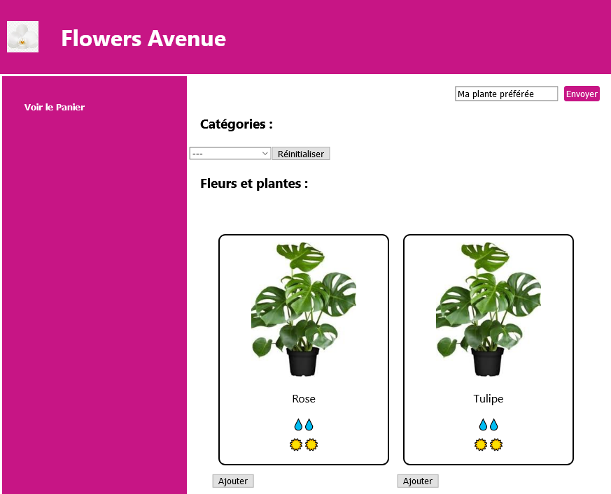

### Live version [here](https://virginiebouvarel.github.io/projets_perso/calculator/).

# React Flowers Avenue

## Détails

> Technos utilisées : HTML/CSS/JS/REACT

Pour ce projet mon objectif était de réaliser une mini application React afin d'acquérir les bases du framework et d'évaluer son utilisation par rapport à Vue.js.  

Avec ce projet j'ai appris...

- qu'après avoir bien progressé en Vanilla la découverte d'un nouveau framework c'est comme la découverte d'un dialecte. C'est tout pareil sauf que c'est différent.
- que React automatise moins les choses que Vue.js
- à refaire connaissance avec mon débogueur qui s'est refait une santé avec les onglets spécifiques à React.
